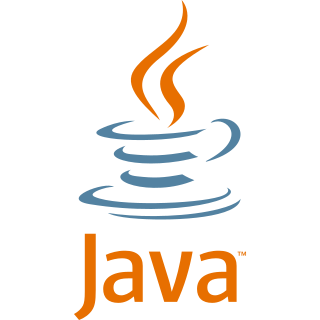

# Pathway to get Java Certified (OCA-OCP)
The major goal of this repository is to provide a roadmap to get one the most difficult professional certifications of the tech world: Oracle Java Certified Associate and Oracle Java Certified Professional. Given the current Java ecossystem is crucial for anyone who wants to succeed into this market, to get such certifications is a must. In this repository you will find Java code to explore all features of this language, starting with data structures, OOP basics such as inheritance, polymorphism, abstraction and xxxxxx, Collections., Streams, Records, Threads, Concurrency and Parallelism, coding challenges from Leetcode, Hackerrank and others, with a focus in clean code and self-explaining so if you can explore how good or bad was my approach to solve the problem and if possible associate a big O (O(n)) metric to qualify the solution. This is how I succeeded in tackling this challenge. Hopefully can help somebody else. By the way, as the goal is to practice the fundamentals of Java language there is not maven or gradle. 
## _Table of contents_
- [Overview](#overview)
- [Screenshot](#screenshot)
- [Links](#links)
- [Built with](#built-with)
- [What I practiced](#what-i-practiced)
- [Continued development](#continued-development)
- [Resources](#useful-resources)
- [Author](#author)
- [Acknowledgments](#acknowledgments)
## _Overview_
The design is structured as shown:
- src|
    - udemyOcaOne|

## _Screenshot_
[](https://ferreiras.dev.br)
## _Links_
- Live Site URL: [https://ferreiras.dev.br] 
## _Built with_
| Java | Git | IntelliJ | CentOS | VS Code | 
|----------|----------|----------|----------|----------|
|  |  |  |   

 ## _What I practiced_
```java
public class AverageGrades {

  public static void main(String[] args) {
    String[][] scores = {
            {"Bob", "85"},
            {"Mark", "100"},
            {"Charles", "63"},
            {"Mark", "100"},
            {"Bob", "95"},
            {"Mark", "100"},
            {"Ricardo", "63"},
            {"Perpetua", "100"},
            {"Perpetua", "85"},
            {"Perpetua", "95"},
            {"Perpetua", "25"},
            {"Mark", "100"},
    };
    int bestOfAverages = bestAverage(scores);
    System.out.println("The best Average is: " + bestOfAveages);
  }
  
  public static int bestAverage(String[][] scores) {
    int bestAverage = Integer.MIN_VALUE;
    int average = 0;
    Map<String, List<Integer>> calculateAverage = new HashMap<String, List<Integer>>();
    for (String[] score : scores) {
      String name = score[0];
      int grade = parseInt(score[1]);
      List<Integer> listOfScores = new ArrayList<Integer>();
      if (calculateAverage.containsKey(name)) {
        listOfScores = calculateAverage.get(name);
        listOfScores.add(grade);
        calculateAverage.put(name, listOfScores);
      } else {
        listOfScores.add(grade);
        calculateAverage.put(name, listOfScores);
      }
    }
    for (List<Integer> value : calculateAverage.values()) {
      int sum = 0;
      int count = 0;
      for (int v : value) {
        sum += v;
        count++;
      }
      average = (int) Math.floor((double) (sum / count));
      bestAverage = Math.max(average, bestAverage);
    }
    return bestAverage;
  }
}
```  
## _Continued development_
- Next step: Add one hour of Java coding per day     
### _Useful resources_
- [https://docs.oracle.com/en/] Nothing as the official doc.
- [https://javaranch.com/] Mandatory pit stop at this awesome website!.
- [https://www.geeksforgeeks.org/complete-roadmap-to-learn-dsa-from-scratch/] Good stuff!
## _Author_
- Website - [https://ferreiras.dev.br] 
## Acknowledgments
- www.oracle.com